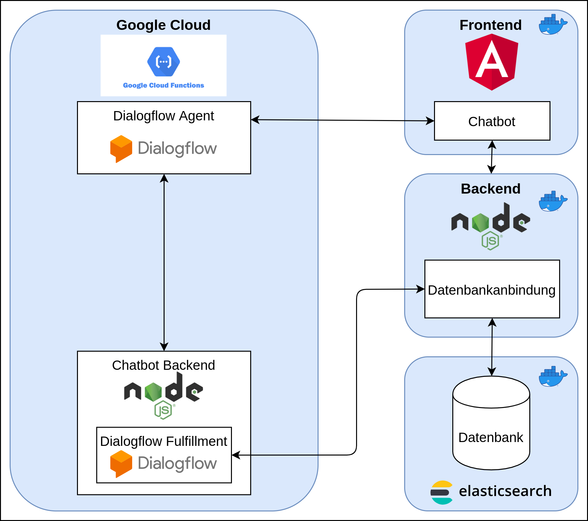

# Localhorst Chatbot Backend

## About

This Repository contains the source code for the backend of the chatbot. Whenever functionalty other than returning a
simple text is required, the chatbot backend is involved.

The solution was developed in the context of the german "WirVsVirus" hackathon. It has been documented in this [DevPost Blog](https://devpost.com/software/1_016_a_lokale_unternehmen_support_your_localho-r-st) 

This particular module has the purpose to process messages, which users send to the chatbot. It is applied to messages, 
where the bot shows buttons for a more easy selection, or where the bot provides a list of results in form of a carousel.
Additionally, the module takes over processing of more complex processes, such as to collect important user information
and query respective content from a backend or database.

## Architecture

The following architecture applies to the holistic system:



## Structure

The backend for the dialog is deployed aa a cloud function, i.e. serverless. The module itself consists of the `index.js`
and `package.json`. The code is based on a Node.JS application, and deployed as a cloud-function in the Google Cloud Platform.

The current endpoint of the latest deployment is: `https://us-central1-dummy-ybfjgq.cloudfunctions.net/dialogflowFirebaseFulfillment`.
The service receives POST requests coming from the chatbot. The body of those requests contain objects in the proprietary
format of Google Dialogflow. The system then maps the "intent" of the utterance to one of the functions described in the code.

## Functions

The module contains the following functions:

1. welcome
2. companyType
3. problemType
4. recommendationType

Each of those functions is being executed whenever an utterance has thhe respective intents - the functions are named according 
to the intents, which cause them to be executed.

### welcome

This function processes request, which have the intent "Default Welcome Intent". When this intent is triggered, the backend will return
a payload, which causes the frontend to also display a number of buttons. The buttons are meant for the user to select an industry, where
he or she is working in.

### companyType

This function processes requests, which have the intent "CompanyType". When this intent is triggered, the backend will return 
a payload, which causes the frontend to display a number of buttons, the buttons are meant for the user to select an area, where
he or she sees the most pressing issue for their current business.

### problemType

This function processes requests, which have the intent "ProblemType". When this intent is triggered, the backend will return a payload,
which causes the frontend to display a number of buttons, the buttons are meant for the user to decide, if they want to receive specific
information about a problem or if they want to see already existing solutions.

### recommendationType

If this intent is triggered, the bot will collect all the decisions, that the user made before, and form a query to the database out of them.
The results will then be displayed in form of a carousel. 

## Technicals

### Buttons

In order to display buttons, the payload, which is being returned has to contain an object named `suggestedActions`. This object
shall be an array, which contains objects of the follwing schema:

```javascript
{
    type: "postBack",
    title: "Einzelhandel",
    value: "Einzelhandel"
}
```

### Carousel

In order to diplay the carousel, the payload, which is being returned, has to contain a property called `attachmentLayout`, 
which has the value 'carousel', as well as an array called `attachments`, which contains a number of objects in the following format,
one per carousel items:

```javascript
{
  title: element.doc.title,
  subtitle: element.doc.description,
  images: [
    {
      url: element.doc.imageUrl || ""
    }
  ],
  buttons: [{
    type: 'postBack',
    title: element.doc.link,
    value: ''
  }]
}
```

## Additional project documentation

The cloud function can be called using the following link
 [Here](https://us-central1-dummy-ybfjgq.cloudfunctions.net/dialogflowFirebaseFulfillment)
 
 Documentation for Google Cloud Functions:
 [Here](https://cloud.google.com/functions/docs)
 
 The GitHub repository of the code:
 [Here](https://github.com/Social-Developers-Club/localhorst-chatbot-backend)
